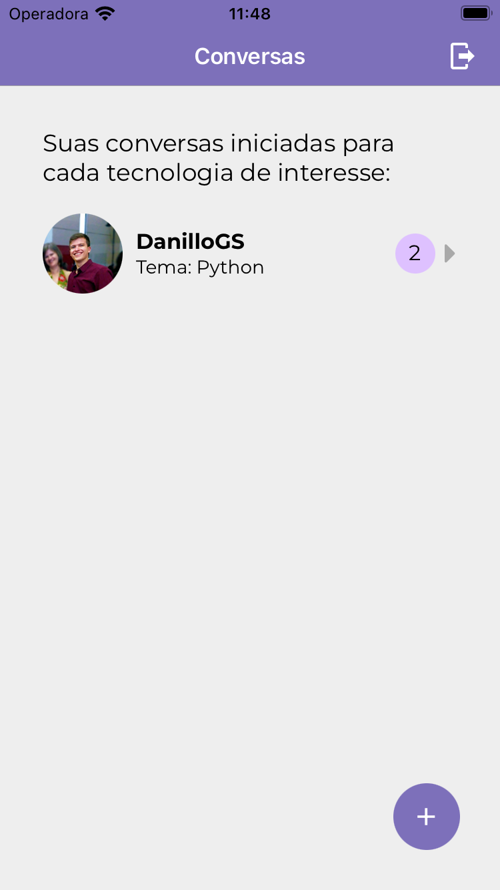

# DevChat: Portas e Adaptadores

[](https://codecov.io/gh/TCC-Gabriel-Danillo/DevChat_Ports_And_Adapters) [](https://sonarcloud.io/summary/new_code?id=TCC-Gabriel-Danillo_DevChat_Ports_And_Adapters) [](https://sonarcloud.io/summary/new_code?id=TCC-Gabriel-Danillo_DevChat_Ports_And_Adapters) [](https://sonarcloud.io/summary/new_code?id=TCC-Gabriel-Danillo_DevChat_Ports_And_Adapters) [](https://sonarcloud.io/summary/new_code?id=TCC-Gabriel-Danillo_DevChat_Ports_And_Adapters) [](https://sonarcloud.io/summary/new_code?id=TCC-Gabriel-Danillo_DevChat_Ports_And_Adapters) [](https://sonarcloud.io/summary/new_code?id=TCC-Gabriel-Danillo_DevChat_Ports_And_Adapters) [](https://sonarcloud.io/summary/new_code?id=TCC-Gabriel-Danillo_DevChat_Ports_And_Adapters) [](https://sonarcloud.io/summary/new_code?id=TCC-Gabriel-Danillo_DevChat_Ports_And_Adapters) [](https://sonarcloud.io/summary/new_code?id=TCC-Gabriel-Danillo_DevChat_Ports_And_Adapters) [](https://sonarcloud.io/summary/new_code?id=TCC-Gabriel-Danillo_DevChat_Ports_And_Adapters)


### Encontre incríveis desenvolvedores e troque experiências.

<div style="display: flex; flex-direction: row; margin: 0 0 50px 0">
   
   
   
</div>

### Requisitos

- Instalar o expo local e em seu smatphone [Expo](https://expo.dev/)
- Configurar um projeto no [firebase](https://firebase.google.com/) 
- Configurar um app no [github apps](https://docs.github.com/en/developers/apps/building-github-apps/creating-a-github-app)

### Configucação

Adicione na pasta src/ui o arquivo .env com as seguintes informações

````
# GITHUB
GIT_CLIENT_SECRET=
GIT_CLIENT_ID=
GIT_AUTHORIZATION_ENDPOINT=
GIT_TOKEN_ENDPOINT=
GIT_REVOCATION_ENDPOINT=

# FIREBASE
FIREBASE_API_KEY=
FIREBASE_AUTH_DOMAIN=
FIREBASE_PROJECT_ID=
FIREBASE_STORAGE_BUCKET=
FIREBASE_MESSAGING_SENDER_ID=
FIREBASE_APP_ID=
FIREBASE_MEASUREMENT_ID=

# GENEREAL
APP_SCHEME=
````


### Executar

Para executar o projeto, basta entrar na pasta src/Ui e executar o seguinte comando

````
  expo start 
````
